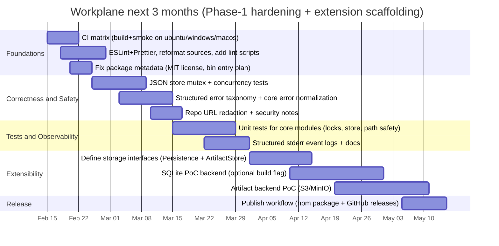

# Workplane Repository Review

## Executive Summary

The **Workplane** repository is already **functionally complete for Phase‑1 “Workspace Manager MCP”**: it runs as an **MCP stdio server**, provisions isolated **Git worktree** workspaces, enforces **workspace mutation locks**, supports **patch apply**, **diff**, **command execution with evidence capture**, and provides an **artifact store** with persistence via a JSON `state.json`. citeturn6view2turn4view2turn4view0turn18view0turn0search2

What’s _missing_ versus a rigorous Phase‑1 deliverable is not the core tool set (that’s present), but the **hardening and operability layer**: **CI**, **true unit tests** (beyond smoke), **repo hygiene (lint/format)**, **concurrency safety of the JSON state store**, and **operator-grade docs** for real-world failure modes (private repo auth, stuck locks, cleanup, observability). citeturn6view0turn9view3turn14view0turn6view8turn18view0turn11view2

The largest practical gap between the mental model and real usage is that Workplane currently assumes a **single-host, single-process**, “friendly local environment” where Git credentials and tooling already work; it also persists `repo_url` into `state.json`, which can inadvertently store secrets if users embed tokens in URLs. citeturn18view0turn6view8turn11view2

A focused 3‑month plan should prioritize: **CI + formatting + license metadata fixes**, then **state-store concurrency safety** (or SQLite), then **unit tests**, then **security and operational docs**, followed by **packaging improvements** and clearly-defined **extension points** (artifact backends like S3, SCM integrations like GitHub, CI runners). citeturn6view0turn6view8turn12view3turn0search1turn0search4

## Phase‑1 Requirements Coverage

Workplane’s Phase‑1 requirements (as written in `docs/requirements.md`) call for: MCP stdio server, workspace isolation via Git worktrees, the full Phase‑1 tool set, evidence capture for command execution, artifacts, persistence (JSON acceptable for v0.1), safety constraints, and a runnable example. citeturn4view2turn4view0turn12view3

### Implemented vs required tools

| Tool                    | Phase‑1 requirement                                         |               Status in repo | Evidence                                           |
| ----------------------- | ----------------------------------------------------------- | ---------------------------: | -------------------------------------------------- |
| `workspace.create`      | Create isolated workspace backed by Git worktree            |               ✅ Implemented | citeturn4view0turn18view0turn9view3           |
| `workspace.get`         | Fetch persisted metadata                                    |               ✅ Implemented | citeturn4view0turn8view2turn9view3            |
| `workspace.list`        | List workspaces with optional filters                       |               ✅ Implemented | citeturn4view0turn6view8turn9view3            |
| `workspace.close`       | Safe close (remove worktree)                                |               ✅ Implemented | citeturn4view0turn18view0turn9view3           |
| `workspace.lock`        | Prevent concurrent mutation (TTL)                           |               ✅ Implemented | citeturn4view0turn6view5turn9view3            |
| `workspace.release`     | Release lock                                                |               ✅ Implemented | citeturn4view0turn6view5turn9view3            |
| `workspace.apply_patch` | Apply patch via git apply; evidence capture                 |               ✅ Implemented | citeturn4view0turn9view0turn9view3            |
| `workspace.diff`        | Compute git diff; optional artifact                         |               ✅ Implemented | citeturn4view0turn9view1turn9view3            |
| `workspace.run`         | Run commands, bounded outputs, denylist, evidence artifacts |               ✅ Implemented | citeturn4view0turn9view2turn9view3turn7view3 |
| `artifact.put`          | Store artifacts per workspace                               |               ✅ Implemented | citeturn4view0turn6view9turn9view3            |
| `artifact.get`          | Fetch artifact                                              | ✅ Implemented (size-capped) | citeturn4view0turn6view9                       |
| `artifact.list`         | List artifacts                                              |               ✅ Implemented | citeturn4view0turn6view9                       |
| `workspace.note.add`    | Optional                                                    |                   ⛔ Stubbed | citeturn4view0turn8view5                       |
| `workspace.note.list`   | Optional                                                    |                   ⛔ Stubbed | citeturn4view0turn8view5                       |

### Implemented vs required Phase‑1 features beyond tools

| Requirement area       | What Phase‑1 expects                                  | Status in repo | Evidence                                 |
| ---------------------- | ----------------------------------------------------- | -------------: | ---------------------------------------- |
| MCP stdio server       | Server uses stdio transport (host spawns process)     | ✅ Implemented | citeturn6view2turn0search4           |
| Git worktree isolation | Workspaces are linked worktrees on dedicated branches | ✅ Implemented | citeturn18view0turn0search2          |
| Root boundary safety   | Operate only under `WORKPLANE_ROOT`                   | ✅ Implemented | citeturn7view0turn18view0            |
| Safe deletion          | Close refuses to delete without marker file           | ✅ Implemented | citeturn18view0turn4view0            |
| Lock enforcement       | Mutations require lock rules (holder_id semantics)    | ✅ Implemented | citeturn6view5turn4view0turn9view3  |
| Evidence capture       | Store stdout/stderr as artifacts; bounded output      | ✅ Implemented | citeturn9view2turn6view9turn4view0  |
| Persistence            | JSON `state.json` with atomic writes                  | ✅ Implemented | citeturn6view8turn7view3             |
| Runnable example       | Two-workspaces demo + Phase‑1 smoke test              | ✅ Implemented | citeturn9view4turn10view0turn9view3 |

### What is missing vs Phase‑1 requirements

Functionally, **the required Phase‑1 tool set is implemented** and is even covered by an end‑to‑end smoke test. citeturn4view2turn9view3turn12view3

However, if you interpret “Phase‑1 requirements” in a practical engineering sense (deliverable quality, testability, security controls), these gaps remain:

- **Tests beyond smoke**: `npm run smoke` is strong and covers tool registration and core workflows, but `npm test` explicitly indicates there are “no tests yet.” This is a gap for ongoing refactors and contributor confidence. citeturn6view0turn9view3
- **CI**: there are no GitHub Actions workflows present (no `.github/workflows/ci.yml`). This increases the risk of regressions, especially cross‑platform. citeturn14view0
- **Lint/format and readability**: code is largely compressed into single‑line TS files and there are no lint/format scripts, despite `AGENTS.md` calling for “Basic lint/format scripts.” citeturn13view1turn6view0turn16view0
- **Security documentation and operator procedures**: docs refer to private repo auth issues and stuck locks, but there is no explicit operator runbook (what to do when locks persist, how to clear locks safely, where state lives, how to rotate roots for debugging). citeturn11view2turn12view2turn12view3
- **Optional tool gap**: notes tools remain stubbed (`workspace.note.add/list`). This is explicitly optional, but it’s still a declared tool surface. citeturn8view5turn4view0

## Areas That Need Improvement

The following improvements are the highest leverage for stability and adoption. Effort estimates are relative (Small = ~hours/1–2 days, Medium = ~3–10 days, Large = multi‑week).

### Code quality and maintainability

Workplane’s core logic is cleanly structured (tools delegate to core modules, safety helpers exist), but maintainability is hindered by **lack of formatting**, pervasive `any` casts in tool handlers, and some error paths that throw generic `Error`s rather than returning structured error codes. citeturn8view0turn18view0turn16view0

**Recommendations**

| Recommendation                                                                 | Why it matters                                                                                                                                    | Effort       |
| ------------------------------------------------------------------------------ | ------------------------------------------------------------------------------------------------------------------------------------------------- | ------------ |
| Add ESLint + Prettier + `npm run lint`/`npm run format`, and reformat TS files | Improves readability and contributor velocity; reduces error-prone diffs                                                                          | Small–Medium |
| Replace `any` tool-args casts with zod inference or typed adapters             | Prevents schema drift and runtime surprises                                                                                                       | Medium       |
| Define a shared error-code taxonomy (enum) and use it across core modules      | Enables orchestrators to reliably handle failures programmatically                                                                                | Medium       |
| Normalize return behavior for command spawn errors (`ENOENT`)                  | Today `workspace.run` can return `ok: true` with `exit_code: null` when spawn fails, which is ambiguous for some orchestrators. citeturn9view2 | Small        |

### Error handling consistency

Several operations in `workspaceCreate` throw generic exceptions for clone/worktree failures; tool handlers catch and wrap, but the resulting error codes are “CREATE_FAILED” rather than a specific machine-readable code reflecting the underlying Git operation. citeturn18view0turn8view2

**Recommendation**: return structured errors directly from core operations (e.g., `GIT_CLONE_FAILED`, `WORKTREE_ADD_FAILED`, `INVALID_BASE_REF`, `FETCH_FAILED`), preserving `stderr/stdout/exit_code` in `details`. citeturn18view0turn6view7 _(Medium effort)_

### Concurrency and persistence safety

The JSON file persistence uses an atomic write pattern (write temp + rename), which protects against partial writes, but it is not inherently safe against **concurrent updates**: multiple tool calls can read the same state snapshot and overwrite each other on write (“last writer wins”). This matters if the MCP host issues multiple concurrent tool calls, or if multiple Workplane server processes point at the same root. citeturn6view8turn7view3

**Recommendations**

| Recommendation                                                              | Why it matters                                                | Effort |
| --------------------------------------------------------------------------- | ------------------------------------------------------------- | ------ |
| Add an in-process mutex around state read-modify-write                      | Prevents lost updates under concurrent tool calls             | Medium |
| Add file locking or move to SQLite (WAL)                                    | Prevents corruption or lost updates across multiple processes | Large  |
| Document “single server process per WORKPLANE_ROOT” as a current constraint | Sets correct expectations and reduces footguns                | Small  |

### Cross‑platform support and command execution UX

Workplane already includes Windows-focused considerations (`windowsHide`, denylisting `powershell/cmd`, stripping `.exe/.cmd/.bat` extensions), but process termination details are tricky across OSes; `SIGKILL` is best-effort and may not kill child processes (process tree). citeturn9view2turn7view3

Additionally, the default denylist blocks common shell entrypoints (`bash`, `sh`, etc.) which is safe-by-default, but can surprise users whose builds rely on shell scripts; a clear, documented policy system (allowlists/per‑tool policies) will matter for adoption. citeturn7view3turn11view1turn12view3

**Recommendations**

| Recommendation                                                                             | Why it matters                                                       | Effort |
| ------------------------------------------------------------------------------------------ | -------------------------------------------------------------------- | ------ |
| Add an explicit allowlist mode (`WORKPLANE_COMMAND_ALLOWLIST`) and policy precedence rules | Makes `workspace.run` usable in real projects while retaining safety | Medium |
| Add “process tree kill” option (where available) and document OS caveats                   | Improves reliability of timeouts and reduces runaway processes       | Medium |
| Add more denylist guidance/examples (safe defaults for CI runners)                         | Reduces “it broke my workflow” reactions                             | Small  |

### CI, packaging, and release hygiene

The repo has no CI workflows, no releases, and package metadata is incomplete. Notably: repository license is MIT, but `package.json` currently lists `"license": "ISC"`, which can confuse users and downstream tooling. citeturn13view2turn6view0turn1view0

**Recommendations**

| Recommendation                                                                                  | Why it matters                                             | Effort |
| ----------------------------------------------------------------------------------------------- | ---------------------------------------------------------- | ------ |
| Add GitHub Actions CI matrix (ubuntu/windows/macos): `npm ci`, `npm run build`, `npm run smoke` | Prevents regressions and validates cross-platform behavior | Medium |
| Fix `package.json` metadata (license=MIT, keywords, author, exports)                            | Improves trust and usability; essential for publishing     | Small  |
| Add an npm “bin” entry (`workplane`) so hosts can run `npx workplane` or installed binary       | Makes integration configs simpler                          | Medium |

## Gaps Between the Mental Model and Practical Usage

Workplane’s documentation and orchestrator prompts correctly emphasize environment variability (missing tools, auth issues, stuck locks), but the repository does not yet fully close the loop with concrete operator-grade guidance and explicit constraints. citeturn11view2turn12view2turn12view3

### Environment assumptions and auth

- **Private repos and auth**: `workspace.create` shells out to `git clone` and relies on whatever credentials Git has available in the runtime environment (credential helper, SSH agent, etc.). There is no first-class support for passing tokens, nor is there a troubleshooting guide for private repo failures. citeturn18view0turn12view2
- **Toolchain assumptions**: docs and examples require Git and Node on PATH (reasonable), but there’s no “Troubleshooting” page that maps common failure signatures (`GIT_NOT_FOUND`, clone auth failures, invalid base refs) to fixes. citeturn9view4turn9view3turn6view7

**Recommendation (Small–Medium)**: add `docs/troubleshooting.md` covering auth and environment setup, and reference it from `docs/hosting.md` and README. citeturn12view2turn4view4

### Sensitive data persistence

Workplane persists `repo_source.repo_url` into workspace records inside `state.json`. If users embed tokens in HTTPS URLs, those secrets could be written to disk. citeturn18view0turn6view8

**Recommendation (Medium)**: implement repo URL redaction before persistence (strip `user:pass@` segments, strip query parameters), and add a prominent note in docs.

### Operator procedures and failure modes

Workplane implements locks with TTL and holder enforcement, and the orchestrator prompt discusses stuck locks and operator intervention; however, there is no explicit operator playbook explaining how to safely recover when:

- a lock is stuck and TTL is long or misconfigured
- the Workplane process crashed mid-write
- `git worktree remove` fails because worktree metadata is stale
- artifacts exceed the inline-return size cap (1MB) and the host needs a path-based fetch approach citeturn6view5turn18view0turn6view9turn11view2

**Recommendation (Medium)**: add `docs/operations.md` with “safe recovery” steps and a clear statement of which files/directories are safe to delete under `WORKPLANE_ROOT`. citeturn7view3turn18view0

### Observability and auditability

Workplane correctly avoids stdout logging in stdio mode, but logs are minimal and there is no structured, per-request event logging or correlation IDs. citeturn6view2turn12view2

**Recommendation (Medium)**: add structured stderr logs (JSON lines) with fields like `event`, `tool`, `workspace_id`, `duration_ms`, `ok`, `error.code`. This materially improves debugging in hosts that capture MCP server stderr (as described in MCP host docs). citeturn0search4turn9view3

## Future Development Roadmap

This roadmap is prioritized for maximum adoption and contributor friendliness, while keeping Workplane’s Phase‑1 tool surface stable. It also aligns with Workplane’s current self-identified “Phase‑1 hardening” needs. citeturn12view3turn4view1

### Short-term milestones

**Focus**: stability, contributor velocity, and safe defaults.

1. **CI + repo hygiene**

- Add GitHub Actions matrix for build/smoke across ubuntu/windows/macos. citeturn6view0turn9view3turn14view0
- Add ESLint/Prettier; reformat code (currently hard to review). citeturn13view1turn16view0turn6view0
- Fix license metadata mismatch (`package.json` vs LICENSE). citeturn6view0turn13view2

2. **State store hardening**

- In-process write mutex for JSON store to prevent concurrent lost updates. citeturn6view8
- Explicitly document whether multiple server processes can share a root (spoiler: not safely today). citeturn7view3turn6view8

3. **Operator documentation**

- Add troubleshooting docs for private repo auth, base_ref resolution, and safe cleanup. citeturn18view0turn4view2turn12view2

### Medium-term milestones

**Focus**: extension points and real-world usability.

1. **Pluggable persistence**

- Introduce a storage interface and add a SQLite backend (WAL). Phase‑1 already notes SQLite as the preferred longer-term solution. citeturn4view1turn4view2

2. **Artifact backends**

- Define an artifact storage interface; add optional S3-compatible backend (S3/MinIO).  
  Suggested extension point: `ArtifactStore` with methods `{ putBytes,getBytes,list,stat }` and a metadata store mapping artifact IDs to URIs.

3. **Command policy evolution**

- Add allowlists/per‑tool policies (instead of denylist-only). Current docs already anticipate this evolution. citeturn11view1turn4view1turn12view3

### Long-term milestones

**Focus**: multi-agent delivery workflow integration and distributed operation.

1. **SCM integration layer**

- Add optional tools for PR creation/commenting (GitHub/GitLab) as separate MCP servers or as Workplane extensions.  
  This keeps Workplane focused on “workspace control plane” responsibilities.

2. **CI integrations**

- Add integrations to trigger and fetch CI results (GitHub Actions, Jenkins) and store logs as artifacts.

3. **Remote transports / multi-host**

- While Workplane is stdio-based today (most compatible), a remote transport (HTTP/streaming) would enable a shared control plane and multiple orchestrator clients. MCP’s server SDK ecosystem supports various server capabilities; Workplane can evolve cautiously here after hardening. citeturn0search1turn0search4

### Three-month timeline



## Suggested First Issues to Open

These are ordered to maximize contributor value quickly and reduce the biggest adoption risks.

### CI: cross-platform build + smoke

**Title**: Add GitHub Actions CI matrix (ubuntu/windows/macos) running build + smoke  
**Description**: Create `.github/workflows/ci.yml` that runs `npm ci`, `npm run build`, `npm run smoke` on ubuntu, windows, and macOS. Ensure `WORKPLANE_ROOT` is set to a temp path in CI (smoke already does this). This prevents regressions and validates OS behavior for `git worktree` and process execution. citeturn9view3turn6view0turn14view0  
**Labels**: `ci`, `cross-platform`, `priority:high`

### Repo hygiene: format + lint

**Title**: Add ESLint + Prettier and reformat TypeScript sources  
**Description**: Add `eslint` + `prettier` config, `npm run lint`, `npm run format`. Reformat code (currently many TS files are single-line) to improve readability and contributions. Update CONTRIBUTING with lint steps. citeturn13view0turn16view0turn6view0  
**Labels**: `dx`, `good first issue`, `priority:high`

### Fix license metadata mismatch

**Title**: Align package.json license and metadata with MIT LICENSE  
**Description**: LICENSE file is MIT, but `package.json` currently says `"license":"ISC"`. Update `package.json` to MIT and fill basic metadata (author, keywords). This avoids downstream packaging confusion. citeturn6view0turn13view2  
**Labels**: `packaging`, `priority:high`

### State store concurrency safety

**Title**: Prevent lost updates in state.json under concurrent tool calls  
**Description**: `WorkplaneStore` uses atomic writes but performs read-modify-write without concurrency control. Add an in-process mutex around state updates, and add tests that simulate concurrent updates (locks + artifacts + workspaces). Document limitation of multiple server processes sharing the same root. citeturn6view8turn7view3  
**Labels**: `core`, `concurrency`, `priority:high`

### Secret redaction for repo URLs

**Title**: Redact credentials in repo_url before persisting workspace metadata  
**Description**: Workspace records persist `repo_source.repo_url` into `state.json`. If users pass tokenized URLs, secrets could be written to disk. Add redaction (strip userinfo/query tokens) or store only a redacted URL, and document best practices for private repos. citeturn18view0turn6view8turn11view2  
**Labels**: `security`, `core`, `priority:high`

## References

```text
Workplane repository
- https://github.com/AnukaMithara/Workplane

MCP docs (server building and SDK)
- https://modelcontextprotocol.io/docs/develop/build-server
- https://modelcontextprotocol.io/docs/sdk
- https://github.com/modelcontextprotocol/typescript-sdk
- https://www.npmjs.com/package/@modelcontextprotocol/sdk

Git worktree documentation
- https://git-scm.com/docs/git-worktree
```
